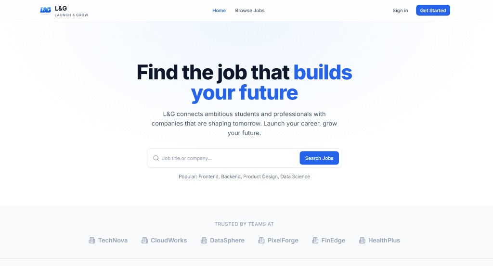
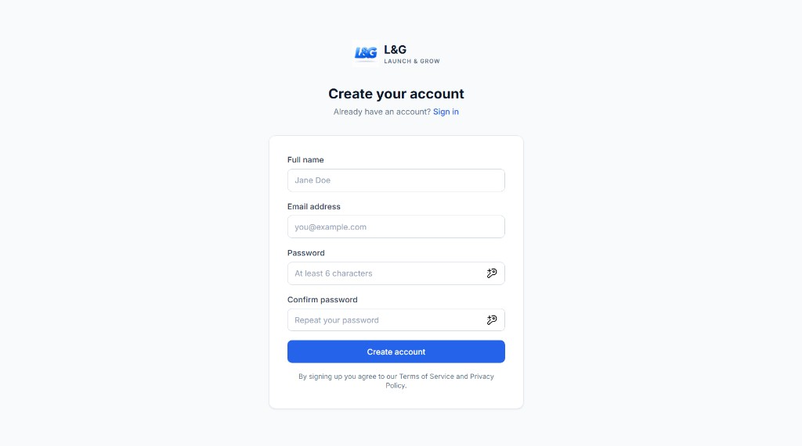

# L&G — Launch & Grow

A full-stack job portal that helps students and professionals find roles, and helps recruiters post and manage job listings.

| Layer | Technology |
| --- | --- |
| Frontend | React 18, TypeScript, Vite, Tailwind CSS, React Router, Axios |
| Backend | Express 5, TypeScript, Mongoose, JWT |
| Database | MongoDB (local or Atlas) |

---

## Screenshots

Add your screenshots under `docs/screenshots/`. The images below are already included. To replace or add more, drop `.png` files into that folder and update the paths in this section.

### Landing page



### Create account (register)



### Sign in (login)

> **Optional:** Save a screenshot of the login page as  
> `docs/screenshots/login-page.png`  
> then uncomment the line below.

<!--  -->

---

## Features

- Public landing page with job search
- Browse and view job details
- Register and sign in (JWT auth)
- Student dashboard
- Recruiter dashboard (create, update, and delete jobs)

---

## Prerequisites

Before you start, install the following:

1. **[Node.js](https://nodejs.org/)** version **20 or higher**  
   Check with: `node -v`
2. **MongoDB** — either:
   - [MongoDB Atlas](https://www.mongodb.com/cloud/atlas) (cloud, recommended for beginners), or
   - Local MongoDB / Docker
3. A code editor such as [VS Code](https://code.visualstudio.com/) or Cursor

---

## Project structure

```text
Job_Portal/
├── backend/          # Express API (TypeScript)
│   ├── src/
│   ├── .env.example  # Copy this to create .env
│   └── package.json
├── frontend/         # React app (Vite + TypeScript)
│   ├── src/
│   ├── .env.example  # Copy this to create .env
│   └── package.json
├── docs/
│   └── screenshots/  # README images
└── README.md
```

---

## Setup (step by step)

Open a terminal in the `Job_Portal` folder, then follow the steps below.

### 1. Backend setup

```bash
cd backend
```

**Create your environment file**

```bash
# Windows (PowerShell)
Copy-Item .env.example .env

# macOS / Linux
cp .env.example .env
```

Open `backend/.env` and set your values:

```env
MONGO_URI=your-mongodb-connection-string
JWT_SECRET=any-long-random-secret
PORT=5000
FRONTEND_URL=http://localhost:5173
```

| Variable | What it means |
| --- | --- |
| `MONGO_URI` | Connection string from MongoDB Atlas or local MongoDB |
| `JWT_SECRET` | Secret used to sign login tokens (keep this private) |
| `PORT` | Port where the API runs (default `5000`) |
| `FRONTEND_URL` | Frontend origin allowed by CORS |

**Install dependencies, build, and start**

```bash
npm install
npm run build
npm start
```

If everything works, you should see:

```text
MongoDB connected successfully
Server is running on port 5000.
```

Health check: open [http://localhost:5000/api/health](http://localhost:5000/api/health) in your browser.

Keep this terminal open while you use the app.

### 2. Frontend setup

Open a **second** terminal:

```bash
cd frontend
```

**Create your environment file**

```bash
# Windows (PowerShell)
Copy-Item .env.example .env

# macOS / Linux
cp .env.example .env
```

`frontend/.env` should look like this for local development:

```env
VITE_API_BASE_URL=http://localhost:5000/api
```

**Install and run**

```bash
npm install
npm run dev
```

Open [http://localhost:5173](http://localhost:5173) in your browser.

---

## Demo login

The current auth flow is demo-oriented:

| Email | Role after login |
| --- | --- |
| `recruiter@jobportal.com` | Recruiter |
| Any other email | Student |

Password must be at least **6 characters** (validated on the frontend). Any non-empty password works with the current demo backend.

---

## Main routes

| Path | Who can access | Description |
| --- | --- | --- |
| `/` | Everyone | Landing page |
| `/jobs`, `/jobs/:id` | Everyone | Browse and view jobs |
| `/login`, `/register` | Everyone | Sign in / create account |
| `/forgot-password` | Everyone | Password reset UI (not wired to backend yet) |
| `/dashboard/*` | Student | Student area |
| `/recruiter/*` | Recruiter | Recruiter area |

---

## API overview

Base URL (local): `http://localhost:5000`

| Method | Endpoint | Auth | Description |
| --- | --- | --- | --- |
| `POST` | `/api/auth/register` | Public | Register a user (demo) |
| `POST` | `/api/auth/login` | Public | Login and receive JWT |
| `GET` | `/api/auth/me` | Bearer JWT | Current user (`id`, `role`) |
| `GET` | `/api/jobs` | Public | List jobs (`search`, `company`, `page`, `limit`) |
| `GET` | `/api/jobs/:id` | Public | Job details |
| `POST` | `/api/jobs` | Recruiter JWT | Create a job |
| `PUT` | `/api/jobs/:id` | Recruiter JWT | Update a job |
| `DELETE` | `/api/jobs/:id` | Recruiter JWT | Delete a job |

---

## What is not in the backend yet

These features exist in the UI and currently use `frontend/src/lib/storage.ts` (localStorage). They are ready to be connected when real APIs are added:

- Forgot / reset password
- Persistent user profiles
- Resume upload
- Job applications and applicants list
- Saved jobs / bookmarks
- Notifications
- Company profiles
- Job analytics

---

## Common issues

| Problem | Likely cause | What to try |
| --- | --- | --- |
| `MongoDB connection failed` / `querySrv ECONNREFUSED` | DNS or wrong `MONGO_URI` | Check `.env`, Atlas Network Access (allow your IP or `0.0.0.0/0` for testing), and internet connection |
| Frontend cannot reach API | Backend not running or wrong `VITE_API_BASE_URL` | Start backend first; confirm URL is `http://localhost:5000/api` |
| CORS error | `FRONTEND_URL` mismatch | Set `FRONTEND_URL=http://localhost:5173` in `backend/.env` |
| Port already in use | Another process on `5000` or `5173` | Stop the other process, or change `PORT` |

---

## Scripts reference

### Backend (`backend/`)

| Command | Purpose |
| --- | --- |
| `npm install` | Install packages |
| `npm run build` | Compile TypeScript to `dist/` |
| `npm start` | Run the compiled server |

### Frontend (`frontend/`)

| Command | Purpose |
| --- | --- |
| `npm install` | Install packages |
| `npm run dev` | Start Vite dev server |
| `npm run build` | Production build |
| `npm run preview` | Preview the production build |

---

## Adding more screenshots

1. Capture the page in your browser.
2. Save the file under `docs/screenshots/` (example: `login-page.png`).
3. Add markdown like this in the **Screenshots** section:

```markdown
### Sign in (login)


```

Suggested filenames:

| File | Page |
| --- | --- |
| `landing-page.png` | Home / landing |
| `login-page.png` | Sign in |
| `register-page.png` | Create account |
| `jobs-page.png` | Job listing (optional) |
| `dashboard-page.png` | Student or recruiter dashboard (optional) |

---

